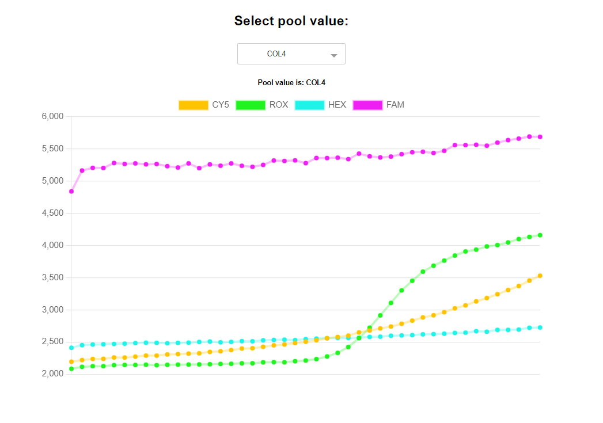

## Contains a React component that renders a chart on selecting values from a Dropdown Menu

>To run, Open Terminal in Project folder and type **npm install and npm start**
 

### Example :

</img>

This project was made with [Create React App](https://github.com/facebook/create-react-app).
